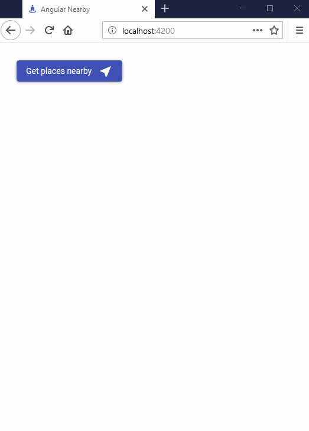

# Angular Nearby

Angular Nearby is a simple [Angular 7](https://angular.io/) application that gets nearby places from [Google Place Search](https://developers.google.com/places/web-service/search#PlaceSearchRequests) based on user's location.

UI was built using [Angular Material](https://material.angular.io/).

This project was generated with [Angular CLI](https://github.com/angular/angular-cli) version 7.3.2.

## Dependencies

Run `npm install` to install required node modules.

## Development server

Run `ng serve` for a dev server. Navigate to `http://localhost:4200/`. The app will automatically reload if you change any of the source files.

## Build

Run `ng build` to build the project. The build artifacts will be stored in the `dist/` directory. Use the `--prod` flag for a production build.

## Live demo

https://angular-nearby.firebaseapp.com/angular-nearby/

## Demo

